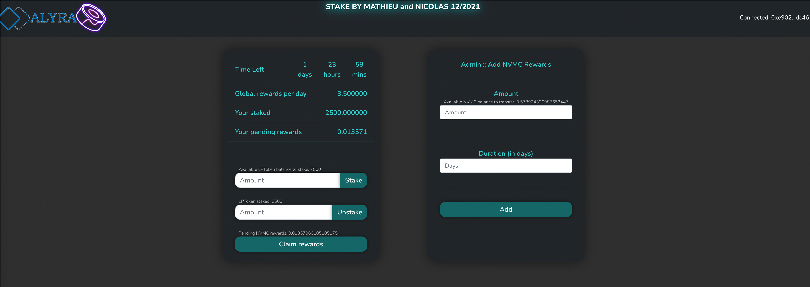

DeFi project par Mathieu C. et Nicolas V.

# Installation
```
git clone git@github.com:Boyquotes/defi-alyra-team.git
```
# Fork UniswapV2
## Installation des dependances
```
cd core/
npm install
```
```
cd perifery/
cd periphery
```
## Compilation des contrats et execution des migrations qui set les pairs et ajoute de la liquidite a celles-ci

```
truffle migrate --reset
```


# Fork Masterchef Sushiswap

# Stacking



- Aller dans le repertoire staking
## Compiler les contrats 
truffle migrate --reset

## Install
1. Install truffle/contract dependencies:
```
yarn install
```
2. Install client:
```
cd client
yarn install
```

## Unit tests
```
truffle test
```

## Run
1. Run ganache:
```
ganache-cli
```
2. Deploy contracts:
```
truffle migrate --reset
```
3. Start front end:
```
cd client
yarn start
```

Reset reward countdown to stop reward    

In truffle console :
```
truffle console:
```    
Execute :
```
timestamp = (await web3.eth.getBlock(await await web3.eth.getBlockNumber()))['timestamp']
advancetime = new Promise((resolve,reject) => { web3.currentProvider.send({jsonrpc:'2.0', method: 'evm_mine', params: [timestamp+60*60*24*15], id: timestamp}, (err, result) => { if (err) { return reject(err) } return resolve(result); }) })
```
